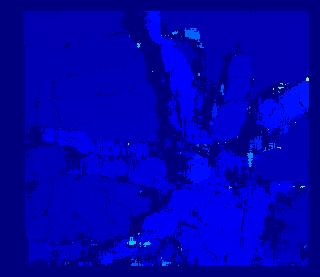

# StereoBM_golang
===
An implementation of the classic stereo vision Block Matching(BM) algorithm. Golang version

===
This code implements a classic stereo BM algorithm.
This is not a good implementation. But it is simple enough.

#### [中国镜像](https://gitee.com/redpower/StereoBM_golang) ####

[]
[]

#### System Requirements ####

The reference code is tested on <b>windows 10, Ubuntu 20.04</b> and requires:
- golang ( go version go1.17.1 linux/amd64. Other versions have not been tested)  

#### Run ####

```go
>> go run .

```
#### Build ####

```go
>> go build
>> ./Stereo_BM

```

#### Known issues ####

None

#### License ####
BSD 2-Clause License. See LICENSE.txt for further details.

